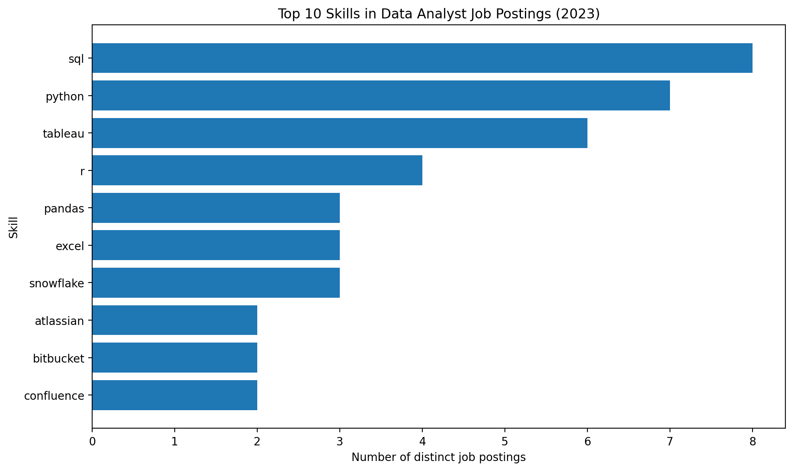

Please refer to the project included in the projects\_sql folder titled 'query\_top\_paying\_job\_skills'.

\## Skills Analysis

I analyzed the skills required across the highest-paying Data Analyst job postings in 2023.

\### Key Findings

\- \*\*SQL\*\* was the most frequently requested skill.

\- \*\*Python\*\* was the second most common.

\- \*\*Tableau\*\* was the most frequently requested visualization tool.

\- \*\*R, Pandas, and Excel\*\* were also commonly requested.

\- Cloud and data-platform technologies such as \*\*Snowflake\*\* also appeared.

